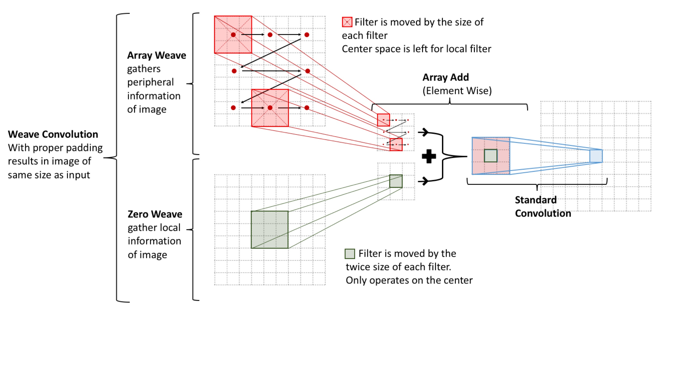

# weave_convolution: Seperable Convolution Layers

This is a independent reserach project by Tim Nonet and supported by Dr. Devika Subramanian (https://www.cs.rice.edu/~devika/) at Rice University.

This project was motivated by the idea of peripheral vision. Human's notice and react to thing based on "local" (direct focused vision) and peripheral visison. In human's these process are indpendent and run in parellel. Why not have a computer tun these in parellel too?

Here is a diagram that explains how this idea works using standard (3 by 3) convolutional filters. (This idea can be generalized further)

From this image it can be seen that the two sets of passes (ArrayWeave and Zero Weave) opperate independelty and thus can be run in parellel. Thus I will intrdouce the following diagrams to visualize how a single weave_convolution layer happens. One would notice it actualyl performs convolution twice.

