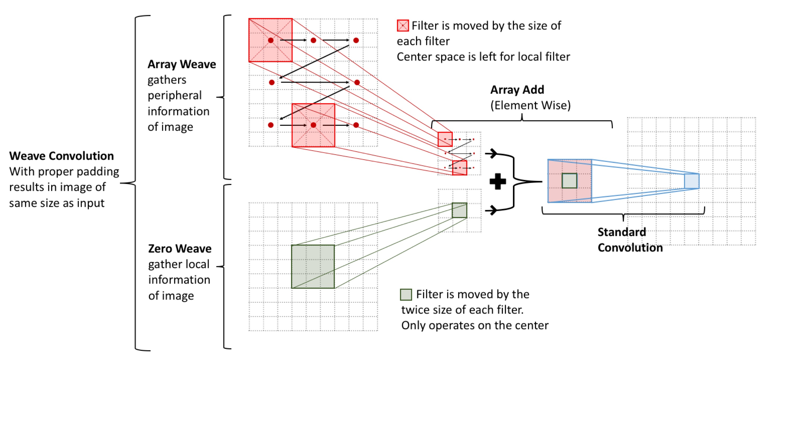
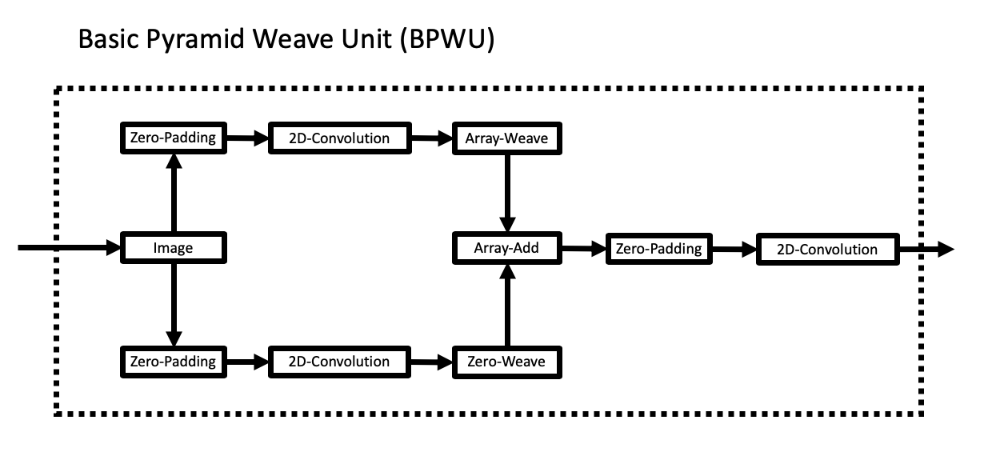
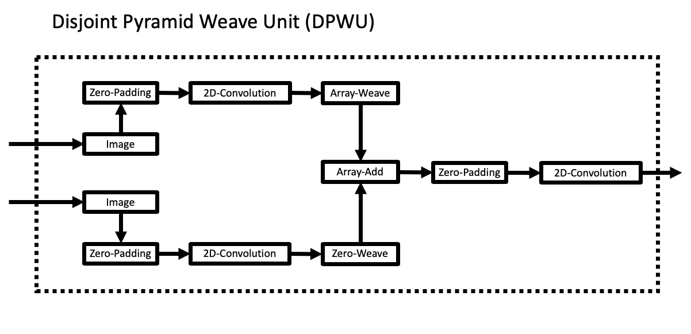
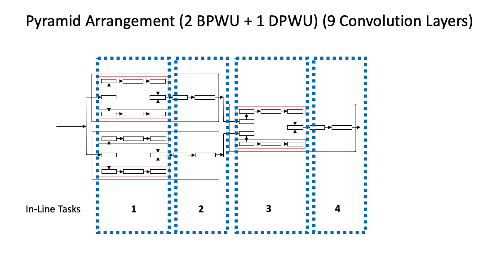
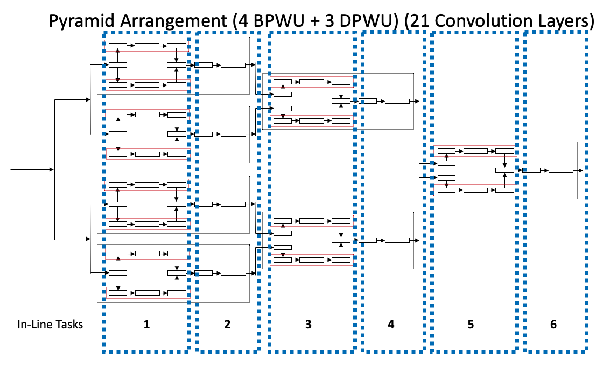
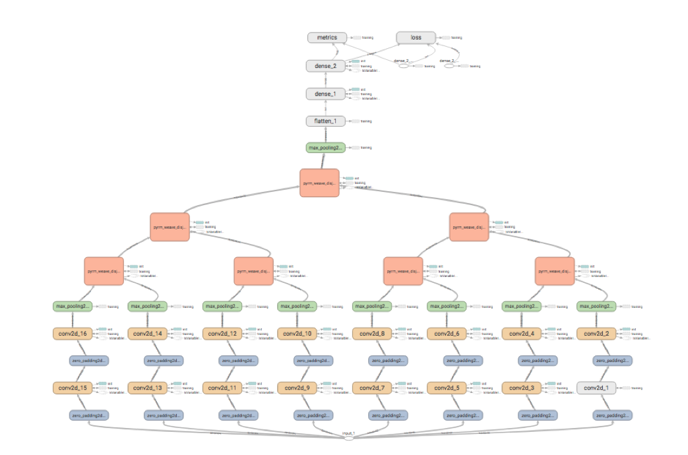

# weave_convolution: Separable Convolution Layers

This is an independent research project by Tim Nonet and supported by Dr. Devika Subramanian (https://www.cs.rice.edu/~devika/) at Rice University.

The idea of peripheral vision motivated this project. Humans notice and react to conditions based on "local" (direct focused vision) and peripheral vision. In humans, these processes are independent and run in parallel. Why not have a computer tun these in parallel too?

Here is a diagram that explains how this idea works using standard (3 by 3) convolutional filters. (This idea can be generalized further). **ArrayWeave** represents the peripheral vision scanning around the edges of the "area of focus" and **ZeroWeave** represents the local or focused vision on the center of the image. These two operators have separate learned filters; therefore, training and backpropagation require no communication.



From this image, it can be seen that the two sets of passes (ArrayWeave and Zero Weave) operate independently and thus can be run in parallel. Thus, the following diagrams are useful for visualizing how a single weave_convolution layer happens. 




However, nothing forces the two branches of the Basic Pyramid Unit to take the same input. We can make these disjoint as seen below



This can allow us to quickly (in log layers) grow the number of independent convolution layers very quickly. This can be seen below.




This logic has been implemented in weave_convolution, and a diagram is seen below. 



# Getting started:

First, clone weave_convolution using git:
```bash
git clone https://github.com/TNonet/weave_convolution
```

Then, cd to the weave_convolution folder and run the install command:

```bash
cd weave_convolution
sudo python weave/weave_unit/cython_weave/setup.py install
```


# Help Wanted (or more realistically Needed)
This project is nowhere near done or even close to being publishable. I have not had time to flesh out this project fully, but I would love to answer questions or find someone interested in continuing to work on this project with me. Please contact me at tim.nonet@gmail.com.
